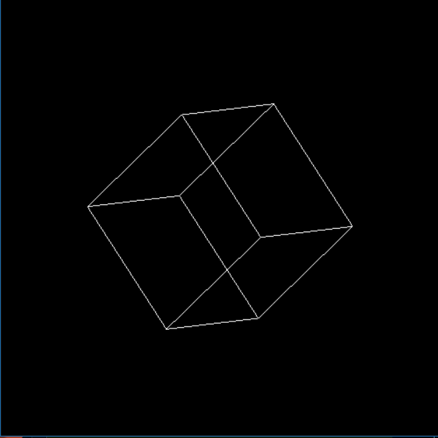

# 3D Cube Rendering with PyOpenGL

A simple Python program that renders a rotating 3D wireframe cube using OpenGL.

 

## Overview

This project demonstrates basic 3D graphics rendering using PyOpenGL. It creates a window displaying a wireframe cube that rotates in 3D space, showcasing fundamental concepts like rotation, perspective, and OpenGL drawing.

## Features

- 3D wireframe cube rendering
- Real-time rotation on X and Y axes
- Simple OpenGL setup and configuration
- Minimal, easy-to-understand code

## Requirements

- Python 3.x
- PyOpenGL

## Installation

Install the required package using pip:

```bash
pip install PyOpenGL
```

## Usage

Run the program from the command line:

```bash
python cube.py
```

A 500×500 window will open displaying the rotating 3D cube. Close the window to exit the program.

## How It Works

The program uses GLUT (OpenGL Utility Toolkit) to:
1. Create a 500×500 display window
2. Initialize the OpenGL context in RGB color mode
3. Draw a wireframe cube at each frame
4. Apply rotation transformations (45° on X-axis, 45° on Y-axis)
5. Continuously refresh the display

## Code Structure

- **Initialization**: Sets up the display window and OpenGL parameters
- **draw()**: The display callback function that renders the cube with rotations
- **Main Loop**: `glutMainLoop()` handles window events and continuous rendering

<!-- ## Future Enhancements

- Add animation/continuous rotation
- Interactive controls (keyboard/mouse)
- Solid cube rendering with textures
- Multiple 3D objects
- Lighting and shading effects
-->